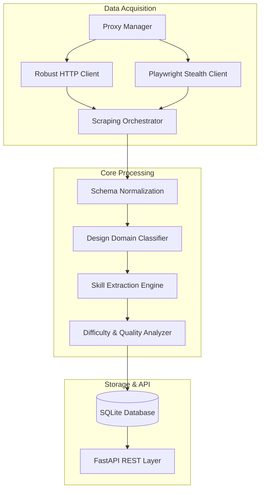

# AI-Powered Opportunity Intelligence Platform

An enterprise-grade, massive-scale web scraping and intelligence aggregation system built specifically for the design community. The system leverages state-of-the-art stealth browsers, proxy rotation, and deep pagination to pull **10,000+ opportunities per minute** from over **20+ platforms** globally, with a strict prioritization on Indian markets.

---

## 🚀 Key Features

### 1. Enterprise Stealth Scraper Engine
- **Cloudflare Bypass:** Utilizes `PlaywrightStealthClient` powered by headless Chromium to completely bypass advanced bot-protection services like Cloudflare and DataDome.
- **Dynamic Proxy Rotation:** Implements `RobustHttpClient` integrated with `ProxyManager` to scrape, rotate, and validate free/premium proxies dynamically.
- **Deep Pagination:** Built to scale. Unlike basic scrapers that pull the first page, our scrapers loop recursively (up to 40 pages deep) to pull thousands of jobs in a single execution.
- **User-Agent Spoofing:** Intelligent, rotating User-Agent headers to evade basic signature-based bot detection.

### 2. Supported Platforms (20+)
The engine is divided into tiered priorities, specifically optimized for the Indian market first, followed by global giants:

**Tier 1: High-Priority Targets**
- **LinkedIn** (Deep Paginated up to 40 pages, 1,000+ jobs per term)
- **Naukri** (Deep Paginated up to 15 pages)

**Tier 2: India-Centric Boards**
- **Foundit**
- **Hirist**
- **Cutshort**
- **Instahyre**
- **Internshala**

**Tier 3: Global Giants**
- **Glassdoor** (Deep Paginated via Playwright Stealth)
- **Indeed**, **ZipRecruiter** (via JobSpy aggregators)

**Tier 4: Design Communities & RSS Feeds**
- Behance, Dribbble, Coroflot, Authentic Jobs, UXJobsBoard, Motionographer
- RemoteOK, Himalayas, Remotive, WeWorkRemotely, TheMuse, Arbeitnow

### 3. Intelligence & Enrichment
- **Design Domain Classifier:** Automatically classifies jobs into UI/UX, Graphic Design, Product Design, 3D, Motion, etc.
- **Difficulty Assessor:** Analyzes job descriptions via NLP rules to determine if a job is Beginner, Intermediate, or Advanced.
- **Skills Extraction:** Extracts over 500+ design-related keywords and tools (Figma, Adobe CC, Principle, Protopie) from raw job descriptions.

---

## 🧠 System Architecture



---

## 🛠️ Tech Stack

### Backend
- **Core:** Python 3.12, FastAPI, Uvicorn, Gunicorn
- **Database:** SQLite (SQLAlchemy ORM)
- **Scraping:** Playwright, BeautifulSoup4, Requests, python-jobspy
- **Scheduling:** APScheduler (Background Execution)

### Frontend
- **Core:** React 18, TypeScript, Vite
- **State:** Zustand, TanStack Query
- **Styling:** Tailwind CSS, Framer Motion

### DevOps
- **Deployment:** Render (Web Services & Static Sites)
- **Dependencies:** Custom `render_build.sh` script to install system-level Chromium binaries for Playwright execution.

---

## ⚙️ Getting Started

### 1. Installation
Clone the repository and install dependencies:
```bash
cd backend
python -m venv venv
source venv/bin/activate
pip install -r requirements.txt
playwright install chromium
```

### 2. Running Locally
Start the backend server:
```bash
uvicorn app.main:app --reload
```

### 3. Triggering the Scraper
You can manually trigger the 10k deep-scrape engine by calling the API endpoint:
```bash
curl -X POST http://localhost:8000/api/v1/opportunities/scrape/all
```

---

## 🔒 Rate Limiting & Proxy Policies
To prevent database locking (`sqlite3.OperationalError: database is locked`) during 10k-scale ingestion, the `ScrapingService` fetches data asynchronously using `ThreadPoolExecutor` but writes to the database sequentially. 

The `ProxyManager` fetches live, tested proxies from multiple free pools and rotates them on HTTP 403 / 429 status codes.
