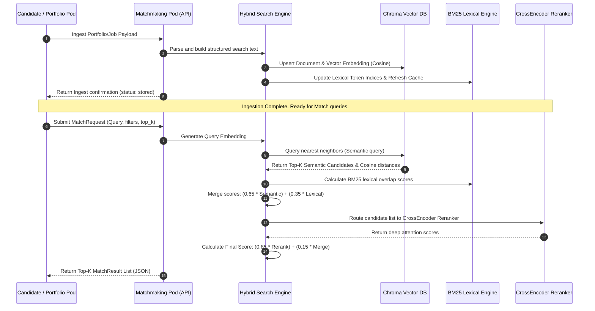
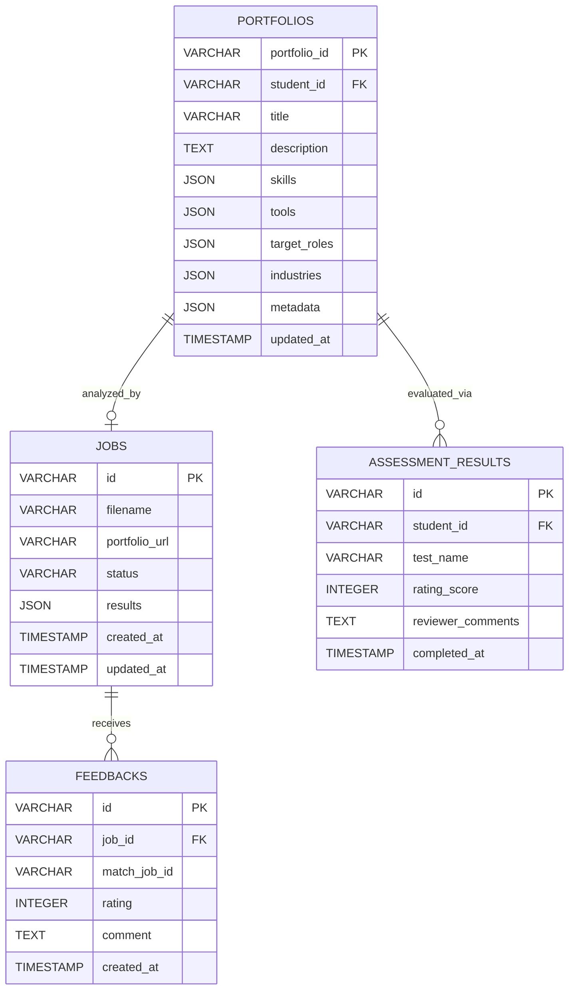
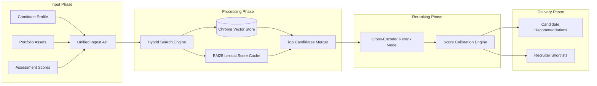

# AI Matchmaking Pod
## Comprehensive System Documentation & Architectural Blueprint

This document details the functional specifications, database models, technical architecture, and integration schemas of the **AI Matchmaking Pod**. It serves as the primary technical specification for engineering teams, integration partners, and system administrators.

---

## 1. Pod Objective & Problem Statement

### Objective
To automate, scale, and refine the process of connecting candidates (specifically design, developer, and creative students) with ideal employment opportunities. The pod matches candidates to jobs and jobs to candidates using hybrid semantic-lexical search models and context-aware rerankers.

### Problem Statement
Traditional applicant tracking systems (ATS) rely on raw keyword matching, missing context, project depth, and structural design artifacts. Conversely, manual portfolio reviews do not scale. By marrying portfolio details, skill profiles, and assessment outcomes with job descriptions, this pod resolves the mismatch between candidate skills and recruiter expectations.

---

## 2. Complete Workflow & Matchmaking Process

The matchmaking workflow is split into two pathways: **Data Ingestion/Indexing** and **Active Matchmaking (Search & Scoring)**.

### A. End-to-End Matchmaking Process



### B. Candidate-to-Job Matching Flow
1. **Candidate Profile Initialization**: The Candidate Pod collects portfolio files, URLs, and assessment data.
2. **Text Construction**: The system compiles a unified searchable representation:
   $$\text{Portfolio Text} = \text{Title} + \text{Description} + \text{Skills} + \text{Tools} + \text{Target Roles} + \text{Industries}$$
3. **Multi-Vector Indexing**: Generates embeddings using the configured embedding service (768-dimension vectors) and stores them in ChromaDB.
4. **Hybrid Search Execution**: During a match query, the system extracts the semantic neighborhood while executing a lexical sweep across all tokenized job entries in cache.
5. **Contextual Reranking**: Re-orders the top candidates utilizing a Deep CrossEncoder network.

---

## 3. Core Modules & Responsibilities

| Module Name | Responsibilities | Key Technologies |
| :--- | :--- | :--- |
| **API Entry Controller** | Manages routes, verifies X-API headers, validates JSON request/response structures. | `FastAPI`, `Pydantic` |
| **Hybrid Search Engine** | Orchestrates search queries, performs semantic-lexical merges, and interfaces with the Rerank block. | `Python`, `Numpy` |
| **Vector DB Repository** | Connects to local persistent or Cloud-based Chroma collections; handles metadata filters. | `chromadb` |
| **Lexical Indexer** | Tokenizes search documents and manages TF-IDF / BM25 term weighting cache. | `rank_bm25` |
| **Contextual Reranker** | Executes deep pair-wise relevance predictions to determine precise role/experience alignments. | `sentence-transformers`, PyTorch |
| **Embedding Generator** | Converts textual portfolios and jobs into high-dimensional vector spaces. | HuggingFace, OpenAI API |

---

## 4. Matching Logic & Scoring Formulation

The matchmaking process computes matching scores using a three-stage mathematical pipeline.

### Stage 1: Semantic Distance Evaluation
Calculates the Cosine Similarity between the query vector $V_q$ and the target vector $V_t$:
$$\text{Cosine Similarity}(V_q, V_t) = \frac{V_q \cdot V_t}{\|V_q\| \|V_t\|}$$
$$\text{Semantic Score} = \max\left(0.0, 1.0 - \text{Cosine Distance}\right)$$

### Stage 2: Lexical Score Evaluation (BM25)
Utilizes the **BM25Okapi** algorithm to count exact keyword matches across tokenized indices, normalizing the raw scores:
$$\text{Lexical Score}_t = \frac{\text{BM25Score}_t}{\max(\text{BM25Scores})}$$

### Stage 3: Score Merging & Reranking
1. **Initial Merged Score**:
   $$\text{Base Score}_t = 0.65 \times \text{Semantic Score}_t + 0.35 \times \text{Lexical Score}_t$$
2. **Reranker Alignment**: If a reranker is active, the query text and target descriptions are processed by the CrossEncoder model:
   $$\text{Final Match Score}_t = 0.85 \times \text{Rerank Score}_t + 0.15 \times \text{Base Score}_t$$

---

## 5. System Inputs (Cross-Pod Data Schema)

```
┌────────────────────────────────────────────────────────────────────────┐
│                              SYSTEM INPUTS                             │
├───────────────────────┬────────────────────────────────────────────────┤
│ Candidate Pod         │ student_id, target_roles, geographic_filters   │
├───────────────────────┼────────────────────────────────────────────────┤
│ Portfolio Int. Pod    │ parsed_skills, parsed_tools, projects_metadata,│
│                       │ design_artifacts (wireframes, system tokens)   │
├───────────────────────┼────────────────────────────────────────────────┤
│ Assessment & Int. Pod │ verification_scores, test_ratings, comments    │
├───────────────────────┼────────────────────────────────────────────────┤
│ Recruiter Pod         │ job_id, job_title, skills, tools, location,    │
│                       │ job_type (hybrid/remote), experience_threshold │
└───────────────────────┴────────────────────────────────────────────────┘
```

---

## 6. System Outputs

The API outputs a structured matching response containing:
- **Match Score**: A float indicating alignment (0.0 to 100.0).
- **Match Breakdown**: Distinct evaluations of skill, portfolio, experience, assessment, and industry domain matches.
- **Recommended Entities**: Lists of matched jobs (for candidates) or matched candidates (for recruiters).
- **Fit Status Indicators**: Categorizations (e.g. `Strong Match`, `Good Match`, `Potential Match`, `Low Match`).

---

## 7. AI Components

1. **Embedding Model**: Defaulting to `SentenceTransformer` architectures (e.g., `all-MiniLM-L6-v2` or `all-mpnet-base-v2`) outputting 384 or 768 float dimensions.
2. **Vector Space Database**: ChromaDB configured with **HNSW (Hierarchical Navigable Small World)** indexing using **Cosine Distance**.
3. **Lexical Retrieval Engine**: `BM25Okapi` leveraging English NLP tokenization patterns.
4. **Reranking Engine**: `CrossEncoder` model (e.g., `cross-encoder/ms-marco-MiniLM-L-6-v2`) to capture semantics and keyword positions.

---

## 8. Scoring Structure Breakdown

The final match score is a weighted combination of 5 primary indicators:

| Factor | Weight | Evaluation Method |
| :--- | :--- | :--- |
| **Skill Match** | **30%** | Overlap check between required job skills/tools and candidate skills/tools. |
| **Portfolio Match** | **25%** | Contextual parsing of projects, outcomes, design artifacts, and Figma file properties. |
| **Assessment Match** | **20%** | Performance ratings from automated challenge platforms. |
| **Experience Match** | **15%** | Candidate's years of experience evaluated against job seniority requirements (senior/mid/junior). |
| **Domain Match** | **10%** | Alignment between the candidate's target industries and the hiring company's domain. |

---

## 9. Database Requirements

### A. Schema Diagram (Entity Relationship Model)



### B. Relational Schema DDL

```sql
-- Create Portfolios Table
CREATE TABLE portfolios (
    portfolio_id VARCHAR(255) NOT NULL,
    student_id VARCHAR(255) NOT NULL,
    title VARCHAR(255) DEFAULT '',
    description TEXT NOT NULL,
    skills JSON NOT NULL,
    tools JSON NOT NULL,
    target_roles JSON NOT NULL,
    industries JSON NOT NULL,
    metadata JSON DEFAULT NULL,
    updated_at TIMESTAMP DEFAULT CURRENT_TIMESTAMP ON UPDATE CURRENT_TIMESTAMP,
    CONSTRAINT pk_portfolios PRIMARY KEY (portfolio_id)
);

-- Create Assessment Results Table
CREATE TABLE assessment_results (
    id VARCHAR(255) NOT NULL,
    student_id VARCHAR(255) NOT NULL,
    test_name VARCHAR(255) NOT NULL,
    rating_score INTEGER NOT NULL,
    reviewer_comments TEXT DEFAULT NULL,
    completed_at TIMESTAMP DEFAULT CURRENT_TIMESTAMP,
    CONSTRAINT pk_assessment_results PRIMARY KEY (id),
    CONSTRAINT chk_score CHECK (rating_score >= 0 AND rating_score <= 100)
);

-- Create Index definitions for optimization
CREATE INDEX idx_portfolios_student ON portfolios(student_id);
CREATE INDEX idx_assessment_student ON assessment_results(student_id);
```

---

## 10. System Integrations

1. **Candidate Pod**: Feeds base bio information, demographic filters, geographic preferences, and target jobs.
2. **Portfolio Intelligence Pod**: Feeds processed portfolio data, structured projects, visual style flags, and design artifact categories.
3. **Assessment Pod**: Supplies objective evaluation scorecards, coding task reviews, and design reviews.
4. **Recruiter Pod**: Receives matched talent shortlists and provides job description parameters.
5. **Scheduling Pod**: Automates interviewer calendar invites for candidates who cross a Match score threshold (e.g. > 80%).

---

## 11. Screen Layouts & User Flows

### A. Candidate-Side Screens
1. **Interactive Portfolio Workspace**: Allows dragging and dropping PDF assets and pasting Figma/Behance URLs.
2. **Dynamic Jobs Recommendations Dashboard**: Displays active job match percentages along with visual guides pointing out skill alignment details.
3. **Feedback Panel**: Allows candidates to flag mismatching job recommendations.

### B. Recruiter-Side Screens
1. **Job Requisition Creation Panel**: Recruiter inputs parameters and details to auto-generate embedding query strings.
2. **Candidate Shortlist Screen**: Ranks matching candidate profiles by score.
3. **Match Analytics Modal**: Shows detail-by-detail alignment breakdowns (skills matched vs missing, experience alignment, portfolio design artifacts).

---

## 12. Reports Generated

1. **Candidate Match Report**: A detailed breakdown showing overlapping competencies, missing technical capabilities, and recommended training paths.
2. **Talent Ranking Summary Report**: Prepared for hiring managers to display the top 10 matched candidates for a role, with visual skills maps.
3. **Match Feedback & Model Analytics Report**: An administrative report tracking feedback loops, displaying Average Rating vs. Match Score.

---

## 13. Data Flow Architecture

The dynamic flow of data through the system is structured as follows:



---

## 14. Technology Stack

- **Web Service Framework**: `FastAPI` (Python 3.10+)
- **Metadata Validation**: `Pydantic v2`
- **ORM & DB Engines**: `SQLAlchemy`, `PostgreSQL` / `SQLite`
- **Vector DB Store**: `ChromaDB` (Persistent local or cloud deployment)
- **Vector Processing**: `Sentence-Transformers` (PyTorch backend), `Numpy`
- **Keyword Indexing**: `Rank-BM25` (Okapi implementation)
- **Scraper / Parsers**: `BeautifulSoup4`, `PyMuPDF` (fitz), `httpx`

---

## 15. Future Scope & Roadmaps

1. **Interactive Reinforcement Feedback**: Use recruiter ratings (1-5 star database entries) to automatically adjust the semantic/lexical weights ($0.65$ / $0.35$) dynamically.
2. **Multi-Modal Vector Embeddings**: Ingest portfolio screenshots directly into multi-modal vision models to index image representations.
3. **Knowledge Graph Integration**: Map technical capabilities (e.g. knowing "FastAPI" implies knowledge of "Python" and "REST APIs") to improve matching logic for similar tools.
