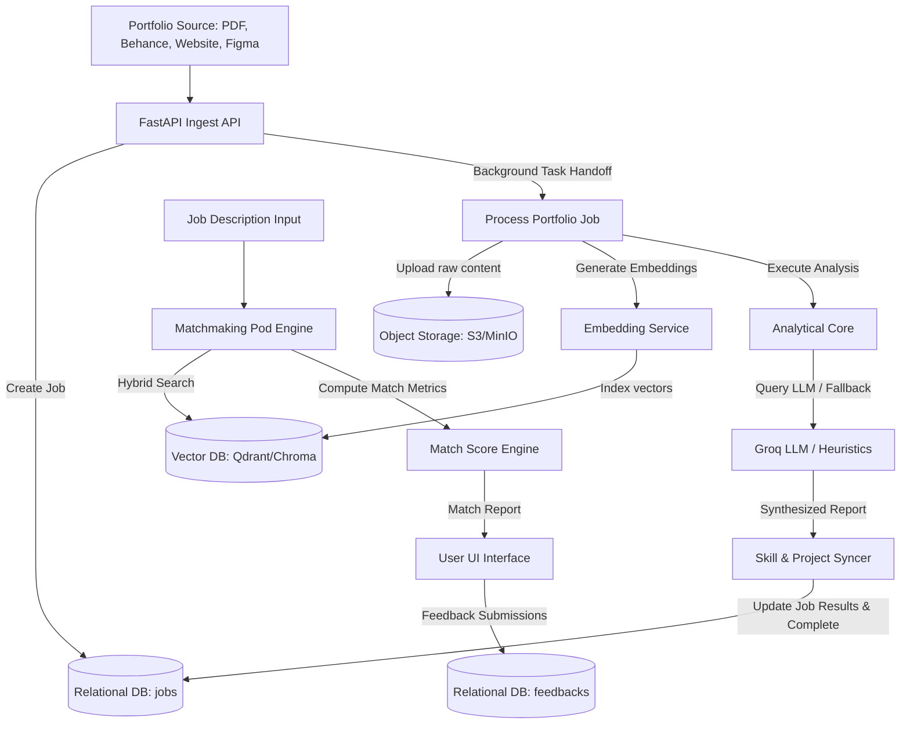

# Portfolio Intelligence Pod
## System Documentation & Architectural Blueprint

This document provides a comprehensive technical overview and schema blueprint for the **Portfolio Intelligence Pod**—a sophisticated pipeline designed to ingest portfolios (PDFs, Web URLs, Behance pages, or Figma files), analyze design and development competencies, index content in vector databases, and perform hybrid-search matchmaking against job descriptions.

---

## 1. Executive Objective
The Portfolio Intelligence Pod aims to:
1. **Automate Competency Extraction**: Eliminate manual resume and portfolio screening by dynamically parsing project descriptions, tools, workflows, soft skills, and design artifacts.
2. **Standardize Skill Taxonomy**: Classify parsed technologies and methodologies into structured buckets (e.g., design tools, methodologies & processes, and soft skills).
3. **Assess Visual & Structure Artifacts**: Directly pull from Figma files, Behance portfolios, and PDF documents to identify critical design system signals, wireframes, moodboards, and interactive prototypes.
4. **Perform High-Accuracy Matchmaking**: Deliver semantic and lexical matching of candidate capabilities against target job descriptions, adapting dynamically to experience thresholds.
5. **Establish Feedback Loops**: Leverage user feedback ratings and critiques to iteratively improve matching accuracy and LLM alignments.

---

## 2. Overall Architecture & Workflow

The architecture is built on a decoupled, asynchronous, pipeline-based pattern. 



### Step-by-Step System Workflow

1. **Ingestion Trigger**: A user uploads a portfolio PDF or provides a URL (Behance, Figma, or Personal Website) to the FastAPI endpoints (`/api/v1/analyze/pdf` or `/api/v1/analyze/url`).
2. **Job Lifecycle Tracking**: A new job record is created in the database with status `processing`.
3. **Raw Ingestion & Scraping**:
   - **PDF**: Text is extracted via `PyMuPDF` (fitz). Images are extracted and saved inline using special image placeholders (`[IMAGE_URL: <url> CAPTION: <caption_text>]`).
   - **Web/Behance**: Pages are scraped, stripping boilerplate navigation headers/footers, isolating target content, and identifying visual image URLs.
   - **Figma API**: Uses the Figma REST API to analyze document node structures (extracting components count, styles count, and detecting specific artifact names like wireframes, mockups, or design systems).
4. **Archiving**: Raw extracted texts and files are archived in MinIO/S3 for reproducibility.
5. **Vector Ingestion**: The first block of text is run through an embedding generator and stored in a vector DB (Chroma/Qdrant) to support hybrid lexical/semantic searches.
6. **LLM Extraction & Classification**: The structured text is processed by a Groq-powered LLM (running Llama-3.3-70b-versatile or a local heuristics engine fallback). The core output is a clean JSON matching a strict template.
7. **Skill & Tool Synchronization**: Project-level tools are synced up to the main candidate profile lists dynamically, keeping profile lists complete.
8. **Synthesized Matchmaking**: The system matches the completed candidate report against pre-defined or custom job descriptions, calculating match percentages and missing capabilities.
9. **Feedback Capture**: The end-user views the match and submits feedback ratings, which are persisted to train subsequent model weights.

---

## 3. Core Modules & Analysis Layers

### A. Core Modules
| Module Name | Technical Base | Responsibility |
| :--- | :--- | :--- |
| **Ingestion Pod** | `FastAPI`, `PyMuPDF`, `BeautifulSoup4`, `httpx` | Handles multi-format input parser (PDF, Figma API, Web, Behance scraper). Integrates inline image injection. |
| **Storage & Archive** | `MinIO` / `AWS S3` Wrapper | Holds raw text source files, uploaded PDF documents, and visual design assets. |
| **Analytical Engine** | `OpenAI Client (Groq/Llama3.3)`, `regex` | Executes structured extraction of skills, projects, and design systems from the ingested content. |
| **Vector DB Repository** | `ChromaDB` / `Qdrant` | Handles storage of document chunks, generating semantic index vectors. |
| **Matchmaking Service** | Hybrid search algorithms | Evaluates candidate capabilities against job profiles using lexical matching, semantic proximity, and years-of-experience adjustments. |

### B. Analytical Layers
The analytical engine scores portfolios based on **7-Module Weight Metrics** during synthesized scoring:
1. **Deep Analysis (20%)**: Extracted insights, contextual strength definitions, and details of candidate's core portfolio direction.
2. **Skill Extractor (15%)**: Identification of software tools, methodologies, and human soft skills.
3. **Design Artifacts (20%)**: Structural artifacts detected (e.g. wireframes, moodboards, user flows, personas, color style guides).
4. **Innovation Score (10%)**: Extracted indicators of cutting-edge solutions, creative problem solving, and complex user flows.
5. **Project Quality (15%)**: Scope of details, timeline durations, and measurable metrics/outcomes in the project list.
6. **Tech/Design Depth (10%)**: Implementation complexities, technology choices, or visual principles detailed.
7. **Consistency (10%)**: Harmony between target roles, listed tools, and executed projects.

---

## 4. Input & Output Payloads

### A. Ingestion Inputs
#### 1. PDF Portfolio Upload (`POST /api/v1/analyze/pdf`)
- **Multipart Form Data**: `file: UploadFile` (must be `.pdf`)

#### 2. Web Portfolio / Figma URL Ingestion (`POST /api/v1/analyze/url`)
```json
{
  "url": "https://www.figma.com/design/AbCdEfGhIjKlMnOpQrStUv/Project-Name"
}
```

### B. Matchmaking Engine Inputs
#### 1. Direct Job Matching (`POST /v1/match` - Hybrid Vector Engine)
```json
{
  "portfolio_text": "Experienced visual designer specializing in branding and web layouts using Figma and After Effects...",
  "portfolio_id": "port-001",
  "student_id": "stud-882",
  "skills": ["Figma", "Branding", "UI Design"],
  "tools": ["Figma", "Photoshop"],
  "target_roles": ["Visual Designer"],
  "industries": ["F&B", "Technology"],
  "filters": {
    "company": null,
    "location": "Remote",
    "industry": "Food & Beverage",
    "job_type": "Full-Time"
  },
  "top_k": 25,
  "use_reranker": true
}
```

---

## 5. Reports Generated (Output Structure)

Upon completion of the background analytical job, a synthesized **Portfolio Intelligence Report** is stored in the database.

### Synthesized Portfolio Report JSON Schema
```json
{
  "report_id": "6ba7b810-9dad-11d1-80b4-00c04fd430c8",
  "candidate_id": "CAN-E8A42F9E",
  "generated_at": "2026-06-10T18:04:34Z",
  "full_name": "Jane Doe",
  "headline": "Lead UI/UX & Brand Designer",
  "summary": "Specialist in building cohesive brand visual identities and responsive web interfaces...",
  "target_roles": [
    "F&B Brand Identity Specialist",
    "UI/UX Designer",
    "Product Designer"
  ],
  "years_experience": 4.5,
  "industries": ["Food & Beverage", "Retail", "Technology"],
  "strengths": ["Visual Storytelling", "Design System Architecture", "Rapid Prototyping"],
  "tools": ["Figma", "Adobe Illustrator", "Adobe Photoshop", "After Effects", "Webflow"],
  "skills": {
    "design_tools": ["Figma", "Illustrator", "Photoshop", "After Effects"],
    "methodologies_and_processes": ["User Research", "Wireframing", "Prototyping", "Information Architecture"],
    "soft_skills": ["Stakeholder Management", "Team Collaboration"]
  },
  "design_artifacts": {
    "artifacts_found": ["wireframes", "mockups", "case studies", "user flows", "design systems"],
    "artifacts_missing": ["usability testing findings", "moodboards"]
  },
  "projects": [
    {
      "name": "FreshCart Brand Ecosystem",
      "type": "Branding & E-Commerce Web Design",
      "role": "Sole Product Designer",
      "client_or_organization": "Studio Fresh Clients",
      "timeline": "3 months",
      "team_size": "Team of 3",
      "details": "Designed the entire web interface and branding assets for a gourmet food delivery platform.",
      "technologies": ["Figma", "Illustrator", "Webflow"],
      "challenges": "Faced difficulties in aligning checkout steps without bloating layout space. Resolved via tabbed interactive forms.",
      "outcomes": "Increased conversion by 18% during testing and reduced design-to-development handoff errors.",
      "images": ["/local_storage/6ba7b810-9dad-11d1-80b4-00c04fd430c8/extracted_img_1_1.png"]
    }
  ],
  "job_matches": [
    {
      "job_id": "job_001",
      "job_title": "Graphic Designer",
      "company": "Studio Fresh",
      "score": 88,
      "fit_status": "Strong Match",
      "matched_skills": ["Figma", "Branding", "Visual Identity", "Illustrator", "Photoshop"],
      "missing_skills": ["Packaging Design", "Typography"],
      "exp_aligned": true
    }
  ]
}
```

---

## 6. Database Schema Design

The relational database layer tracks the ingestion jobs and feedback evaluations. Below is the SQL DDL blueprint specifying primary keys, data types, indexes, and constraints.

### A. SQL Schema DDL (PostgreSQL & SQLite Compatible)

```sql
-- Table: jobs
-- Tracks the processing states and analysis results of uploaded/scraped portfolios.
CREATE TABLE jobs (
    id VARCHAR(255) NOT NULL,
    filename VARCHAR(255) DEFAULT NULL,
    portfolio_url VARCHAR(1000) DEFAULT NULL,
    status VARCHAR(50) DEFAULT 'pending' NOT NULL,
    results JSON DEFAULT NULL,
    created_at TIMESTAMP DEFAULT CURRENT_TIMESTAMP NOT NULL,
    updated_at TIMESTAMP DEFAULT CURRENT_TIMESTAMP NOT NULL,
    CONSTRAINT pk_jobs PRIMARY KEY (id),
    CONSTRAINT chk_status CHECK (status IN ('pending', 'processing', 'completed', 'error'))
);

-- Indexes for performance on Jobs
CREATE INDEX idx_jobs_status ON jobs (status);
CREATE INDEX idx_jobs_created_at ON jobs (created_at);

-- Table: feedbacks
-- Stores user evaluation of matchmaking score accuracy for target job matches.
CREATE TABLE feedbacks (
    id VARCHAR(255) NOT NULL,
    job_id VARCHAR(255) NOT NULL,
    match_job_id VARCHAR(255) NOT NULL,
    rating INTEGER NOT NULL,
    comment TEXT DEFAULT NULL,
    created_at TIMESTAMP DEFAULT CURRENT_TIMESTAMP NOT NULL,
    CONSTRAINT pk_feedbacks PRIMARY KEY (id),
    CONSTRAINT fk_feedbacks_job_id FOREIGN KEY (job_id) REFERENCES jobs (id) ON DELETE CASCADE,
    CONSTRAINT chk_rating CHECK (rating >= 1 AND rating <= 5)
);

-- Indexes for performance on Feedbacks
CREATE INDEX idx_feedbacks_job_id ON feedbacks (job_id);
CREATE INDEX idx_feedbacks_match_job_id ON feedbacks (match_job_id);
```

### B. Table Columns & Relationships

#### 1. `jobs` Table
- `id` (Primary Key): Unique UUID generated per ingestion request.
- `filename`: Nullable field storing the original uploaded PDF name.
- `portfolio_url`: Nullable field storing the input Behance, Figma, or personal web page address.
- `status`: Execution state indicator (`pending`, `processing`, `completed`, or `error`).
- `results`: Stores the complete output report JSON package (profiles, skills, projects, and calculated job matches).
- `created_at` / `updated_at`: Ingestion timestamps.

#### 2. `feedbacks` Table
- `id` (Primary Key): Unique UUID for the review record.
- `job_id` (Foreign Key -> `jobs.id`): Ties the feedback to the specific analyzed portfolio job.
- `match_job_id`: Reference identifying the matched job description.
- `rating`: Rating score integer restricted from `1` (Poor Match) to `5` (Excellent Match).
- `comment`: User critiques or recommendations.
- `created_at`: Feedback submission timestamp.
