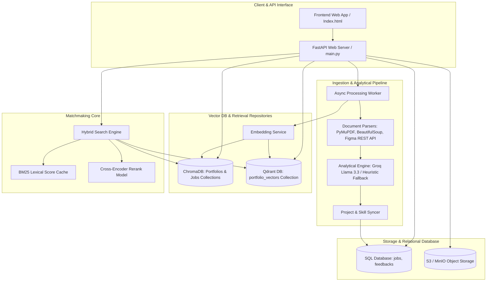

# Portfolio Intelligence & AI Matchmaking System
## Master Architecture & System Documentation

This document serves as the comprehensive guide, developer guide, and architectural specification for the entire **Portfolio Intelligence & AI Matchmaking System**. It defines how raw candidate documents are parsed, stored, indexed, and algorithmically paired with employment requisitions.

---

## 1. System Overview & Core Objectives

The system is a dual-engine platform designed to bridge the gap between creative portfolio evidence and recruiter specifications. It is composed of two primary engines:

1. **Portfolio Intelligence Engine**:
   - Ingests multiple unstructured resume/portfolio formats (PDFs, Behance pages, Figma design canvas files, and generic portfolio websites).
   - Dynamically parses details such as projects, timelines, tools, design artifacts, methodologies, and qualitative outcomes.
   - Archives raw content to S3/MinIO and generates vector embeddings to support semantic indexing.
2. **AI Matchmaking Engine**:
   - Integrates candidate profiles with job description models.
   - Performs hybrid matching (lexical search using BM25 tokenizers combined with semantic cosine distance in vector spaces).
   - Incorporates deep contextual Cross-Encoder reranking models to predict precise candidate-to-job matches.
   - Collects user reviews to continuously calibrate recommendation models.

---

## 2. High-Level System Architecture

The blueprint below outlines the system's microservices and data pipelines:



---

## 3. Directory Structure & Codebase Overview

```
.
├── main.py                     # FastAPI Application, endpoints, & Matchmaking Integration
├── analyzer.py                 # PDF, Web/Behance scrapers, Figma REST parser, & Groq LLM API
├── analyzer_heuristics.py      # Keyword categorization dictionary & local fallback parser
├── database.py                 # SQLAlchemy connection manager (PostgreSQL / SQLite)
├── models.py                   # SQLAlchemy Relational Models (Job, Feedback)
├── storage.py                  # Object Storage Wrapper (AWS S3 / MinIO client)
├── vector_db.py                # Qdrant client connection & collection helper
├── index.html                  # Frontend User Interface dashboard
├── requirements.txt            # System dependencies manifest
├── start.bat                   # Batch script for environment startup
├── matchmaking/                # Hybrid Matchmaking Service Sub-package
│   ├── __init__.py
│   ├── config.py               # Chroma, reranking models, & threshold properties
│   ├── schemas.py              # Pydantic input/output payload definitions
│   └── services/
│       ├── __init__.py
│       ├── embedding.py        # Embedding service setups
│       ├── store.py            # ChromaDB collection repository helper
│       ├── hybrid_search.py    # Hybrid search orchestrator (BM25, Cosine, & Rerank)
│       └── text_utils.py       # Regex tokenizers & search document string compilers
```

---

## 4. Module-by-Module Reference

### A. API Web Server (`main.py`)
- Configures FastAPI with middleware (CORS enabled for development).
- Exposes ingestion endpoints (`/api/v1/analyze/pdf`, `/api/v1/analyze/url`) and background task triggers.
- Implements custom matchmaking endpoints (`/api/v1/report/{job_id}/match`, `/api/v1/report/{job_id}/match/feedback`).
- Integrates the **Student Matchmaking Pod Integration** (`/v1/portfolios`, `/v1/jobs`, `/v1/match`, `/v1/refresh-jobs`).

### B. Portfolio Parser & AI Analyzer (`analyzer.py` & `analyzer_heuristics.py`)
- **PDF Extraction**: Uses `PyMuPDF` (fitz) or `pypdf` fallback. Detects and extracts images, uploading them to S3/MinIO and inserting inline reference placeholders (`[IMAGE_URL: <url> CAPTION: <caption_text>]`).
- **Web Scraping**: Employs `BeautifulSoup4` and `httpx` to extract structured project page details, filtering out navigation headers, sidebars, scripts, styles, and footer templates.
- **Figma Ingestion**: Targets Figma design file keys via the Figma REST API. Analyzes components count, styles count, and matches node frame names against visual design artifacts (wireframes, prototypes, personas, style guides).
- **LLM Synthesis**: Uses Groq-based Llama-3.3-70b-versatile or falls back to a regex heuristic engine to populate structured JSON fields (skills, projects, strengths, experience).

### C. Matchmaking Hybrid Search Engine (`matchmaking/`)
- **Embedding Generation**: Transforms text arrays into normalized dense vector float sets.
- **Lexical Evaluation**: Leverages the **BM25Okapi** algorithm over tokenized descriptions to capture exact terms.
- **Semantic Evaluation**: Connects to ChromaDB database collections to find nearest neighbors using cosine distances.
- **Cross-Encoder Reranker**: Performs contextual evaluations of query-candidate pairs to rank results.

### D. Storage Interface (`storage.py`)
- Detects `S3_ACCESS_KEY` and `S3_SECRET_KEY`.
- Uploads documents, raw scraped text strings, and design assets to S3/MinIO buckets.
- Automatically falls back to localized directory paths if S3 credentials are missing.

### E. Vector Database Wrapper (`vector_db.py`)
- Connects to a cloud-based or localized persistent Qdrant instance.
- Creates the `portfolio_vectors` collection configured with HNSW parameters.
- Indexes portfolio chunks to support RAG (Retrieval-Augmented Generation) queries.

---

## 5. Ingestion & Matchmaking Flows

### Ingestion Flow
```
[User Input: PDF/URL] ──> [API Endpoint] ──> [Create "pending" Job in DB]
                               │
                      (Background Task)
                               ▼
            [Parse PDF/HTML/Figma API Text & Images]
                               │
         ┌─────────────────────┴─────────────────────┐
         ▼                                           ▼
[Upload Raw Assets to S3]                 [Query LLM/Heuristics]
         │                                           │
         │                                  [Extract Profile JSON]
         │                                           │
         ▼                                           ▼
[Generate Embeddings]                      [Deduplicate & Sync Skills]
         │                                           │
         ▼                                           ▼
[Index to Qdrant & Chroma]                 [Update Job Status to "completed"]
```

### Matchmaking Query Flow
```
[Submit Job Description] ──> [Chroma DB: Semantic Filter (Cosine)] ──> [Semantic Candidates]
                                                                                │
                                                                                ▼
[Lexical Filter (BM25 Cache)] ────────────────────────────────────────> [Merged Score List]
                                                                                │
                                                                                ▼
[CrossEncoder Rerank Model] ──────────────────────────────────────────> [Final Score Metrics]
                                                                                │
                                                                                ▼
                                                                     [Recommended Top-K List]
```

---

## 6. Database Specifications

The system uses a combination of relational databases (PostgreSQL/SQLite) and vector databases (Chroma/Qdrant) to manage structured and unstructured information.

### Relational Schema Blueprint

```sql
-- Table: jobs
CREATE TABLE jobs (
    id VARCHAR(255) NOT NULL,
    filename VARCHAR(255) DEFAULT NULL,
    portfolio_url VARCHAR(1000) DEFAULT NULL,
    status VARCHAR(50) DEFAULT 'pending' NOT NULL,
    results JSON DEFAULT NULL,
    created_at TIMESTAMP DEFAULT CURRENT_TIMESTAMP NOT NULL,
    updated_at TIMESTAMP DEFAULT CURRENT_TIMESTAMP NOT NULL,
    CONSTRAINT pk_jobs PRIMARY KEY (id),
    CONSTRAINT chk_status CHECK (status IN ('pending', 'processing', 'completed', 'error'))
);

-- Table: feedbacks
CREATE TABLE feedbacks (
    id VARCHAR(255) NOT NULL,
    job_id VARCHAR(255) NOT NULL,
    match_job_id VARCHAR(255) NOT NULL,
    rating INTEGER NOT NULL,
    comment TEXT DEFAULT NULL,
    created_at TIMESTAMP DEFAULT CURRENT_TIMESTAMP NOT NULL,
    CONSTRAINT pk_feedbacks PRIMARY KEY (id),
    CONSTRAINT fk_feedbacks_job_id FOREIGN KEY (job_id) REFERENCES jobs (id) ON DELETE CASCADE,
    CONSTRAINT chk_rating CHECK (rating >= 1 AND rating <= 5)
);

-- Indexes for performance optimization
CREATE INDEX idx_jobs_status ON jobs(status);
CREATE INDEX idx_feedbacks_job_id ON feedbacks(job_id);
```

### Vector Collection Schemas
1. **Chroma Collections**:
   - `portfolios`: Stores candidate portfolios using cosine distances.
   - `jobs`: Stores parsed job listings.
2. **Qdrant Collections**:
   - `portfolio_vectors`: Stores portfolio content chunks (768 float dimensions) mapped using Cosine Distance metric configs.

---

## 7. Setup & Execution Guide

### Prerequisites
- Python 3.10 or 3.11
- Pip package manager

### Environment Variables
Configure a `.env` file in the root directory:
```env
# Server
PORT=8000

# Relational DB
DATABASE_URL=sqlite:///./portfolio_intelligence.db

# Ingestion APIs & LLM Configurations
GROQ_API_KEY=gsk_your_key_here
GROQ_MODEL=llama-3.3-70b-versatile
FIGMA_ACCESS_TOKEN=figma_personal_token

# Storage Configuration
S3_ENDPOINT=http://localhost:9000
S3_ACCESS_KEY=minioadmin
S3_SECRET_KEY=minioadmin
S3_BUCKET_NAME=portfolio-intelligence

# Vector Databases
QDRANT_URL=http://localhost:6333
CHROMA_MODE=local
CHROMA_PATH=./chroma_data
```

### Startup Instructions
1. Install dependencies:
   ```bash
   pip install -r requirements.txt
   ```
2. Start the development server:
   ```cmd
   start.bat
   ```
   *Or manually launch using Uvicorn:*
   ```bash
   uvicorn main:app --host 0.0.0.0 --port 8000 --reload
   ```
